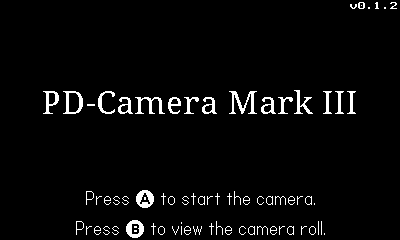
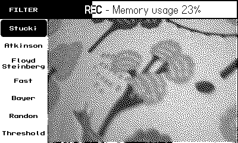
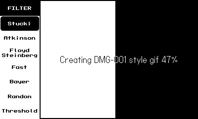
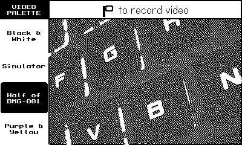
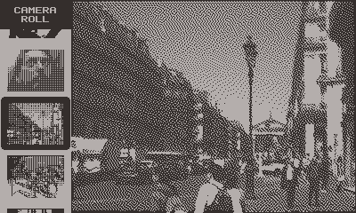
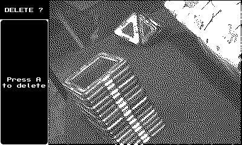

# PD-Camera project App

PD-Camera is an unofficial, experimental accessory for [Panic Inc.](https://panic.com/)'s [Playdate](https://play.date) handheld console, which as the name hopefully suggests allows the device to record pictures as well as animated gifs, in whopping  1-bit color and QVGA (320x240) resolution. Kind of similar to the [1998 accessory for that other monochrome handheld device](https://en.wikipedia.org/wiki/Game_Boy_Camera) (which has 2-bit color and fewer pixels).

> **This repository contains the Lua+C app that runs on the Playdate itself. The hardware and firmware of the PD-Camera accessory it works with can be found [here](https://github.com/t0mg/pd-camera).**

Here's a one minute intro video (click to watch).

## Disclaimer

This project is 
- not affiliated with nor endorsed by [Panic Inc.](https://panic.com/), 
- highly experimental,
- very hacky,
  - oh so hacky.

While I crashed my own Playdate countless times working on this, and it has survived so far, I cannot be held responsible for any damage, data loss, bad selfie, pandemic, etc. that might occur to you while playing with this project. Use this at your own risk. Thanks ❤️.

## How does it work? Why does it exist?

For more context on how this project came to be, you can find its devlog [on Playdate's Dev forum](https://devforum.play.date/t/playdate-oneil-camera/11043) and a deep dive into how it all works [here](https://github.com/t0mg/pd-camera/blob/main/dive.md).

Or read on for installation instructions.

## Installation

If you don't want to modify the source, you can directly grab a prebuilt `pdx.zip` file from the repository's [releases](https://github.com/t0mg/pd-camera-app/releases) and [sideload it](https://help.play.date/games/sideloading/) on your Playdate. Otherwise, read on to build your own.

> Note: the app can run in the Simulator but that won't get you very far, as it is not compatible with the [hardware of this project](https://github.com/t0mg/pd-camera).

## Building

This is a C + Lua "game", which means you'll need to set up your IDE to build C for Playdate by following the instructions [here](https://sdk.play.date/2.0.0/Inside%20Playdate%20with%20C.html#_prerequisites). There are a lot of prerequisites, please follow the doc carefully (and try the [dev forum](https://devforum.play.date/) if you need help).

You can then use the [CMakeLists.txt](CMakeLists.txt) to `build` and `make` the app. The file is based on the SDK examples. I worked with VS Code on Windows and NMake.

## Usage

The app has only 3 screens:
- **home** where there isn't much to do but to choose betwen the other 2
- **viewfinder** where you get the live feed from the camera, and can play with the image settings, snap photos and record "videos" (or more accurately, animated gifs)
- **camera roll** is a simple viewer in which you can browse through your captures, display their time stamp, and delete them

### Getting started

Connect the PD Camera hardware addon to your Playdate and turn it on. Then wake the Playdate and start the Camera app.

### Home screen

In the home screen,
- If the camera device is detected, pressing Ⓐ will enter **viewfinder** mode.
  
  > Note: if the camera is not detected, try unplugging, restarting the app, or power cycling the teensy (fastest option).

- Pressing Ⓑ will open the **camera roll**.

In any other screen, pressing Ⓑ will return to the **home**. It is recommended not to leave the viewfinder on for long stretches (see [known issues](#known-issues)). Use it when you're ready to snap!

### Menus in this app

Both **viewfinder** and **camera roll** use the same menu system, a column on the left side of the screen that uses the remaining 80 pixels not taken by the 320x240 QVGA images the camera produces. Menus are 2-dimensional and work exclusively with the ✛ dpad: 
- ⬅️ and ➡️ to cycle through sections.
- ⬆️ and ⬇️, when available, to toggle between options of the current section. There is no validation necessary.

### Viewfinder mode

Explore the different section of the menus, they should hopefully be self explanatory, especially with real time feedback on the viewfinder image.

At any time:
- pressing Ⓐ takes a picture with the current settings.
- pressing Ⓑ will return to the **home**.

To record a video, use left or right to reach the `VIDEO MODE` section, then up or down to select `On`. A new bar will appear at the top to confirm that. You can now play with the other menu sections or crank and keep cranking to record a movie (like an old mechanical camera!). 

> Note: if you'd rather not have to use the crank to record videos, an alternative input method is available: press and hold Ⓐ. You can enable this via a checkbox in the Playdate system menu.

When the maximum duration is reached or if you stop cranking, the app will start processing the data and save a `.gif` file in your data folder (see [retreiving media](#retrieving-media)). 

The `VIDEO PALETTE` section (only available when `VIDEO MODE` is `On`) allows you to choose from different palette presets for the generated gif. It's still 2 color, but if you feel like trying something else than black & white, you can. This feature is only available in video mode and you obviously won't be able to admire the result on your Playdate directly.

### Camera roll

The menu in this screen displays small thumbnails of your media. 

Videos are represented with 2 columns of holes, as in an actual film strip (and the preview is a still of the first frame of the video).

At any time:
- pressing Ⓑ will return to the **home**.

In the `DELETE` section, pressing Ⓐ will delete the currently displayed photo or video (permanently, cannot be undone).

## Retrieving media

To export your media, plug your Playdate to a computer and reboot to Data Disk (see [here](https://help.play.date/games/sideloading/#data-disk-mode) if you don't know how).

Then navigate to `Data/com.t0m.camera/` if you installed the app manually, or `Data/user.XXXXX.com.t0m.camera/` if you sideloaded a build. 
- the `DCIM` folder contains your still images, in `.gif` format.
- the `MOVIES` folder contains your videos also as `.gif` (but animated).

> Note: it is not recommended deleting media from there (unless you wipe everything out), instead use the **camera roll** of the app, to make sure that the preview thumbnails it uses stay in sync with the `gif` files. Please also do not rename files on your Data Disk for the same reason.

## TODO

- Add sound effects
- Add an animated preview for movies in the camera roll (i.e. generate a `.pdv` in addition to the `.gif`)
- Add stickers and cool stuff
- Fix all the [issues](#known-issues) UwU

## Known issues

Remember the [disclaimer](#disclaimer) from above ? A lot of progress has been made since the early days of this project; but it is still easy to crash the Playdate with it. If you nave to remember only one rule, that would be **never put the playdate to sleep when in viewfinder mode**.

- PD crashes if streaming in viewfinder for more than 4-5 minutes without any interruption (memory leak?). Interrupting the stream from time to time by e.g. returning to the home screen seems to prevent the crash indefinitely (GC?).

- Putting the Playdate to sleep while in viewfinder or while compressing the video into gif crashes and reboots the console.

- Opening system menu while in viewfinder stops the image feed, you'll need to go to home screen and back to viewfinder to restart it.

- The camera roll seems to get faster at wrapping between top and bottom after opening it, exiting and then returning to it for some reason.

- Camera settings currently lose sync if exiting the app and then relaunching it without power cycling the Teensy. Could be fixed in software but not without adding a ton on complexity.

## Credits

Made possible by
- [playdate-reverse-engineering](https://github.com/jaames/playdate-reverse-engineering) by [jaames](https://github.com/jaames)
- [gifenc](https://github.com/lecram/gifenc) by [lecram](https://github.com/lecram)

Fonts
- [Noto Sans font](https://fonts.google.com/noto/specimen/Noto+Sans) with [PDFontTool](https://github.com/abenokobo/PDFontTool) by abenokobo
- Mini Mono Font by Donald Hays ([source](https://devforum.play.date/t/some-small-fonts/1356))

Other
- [`progressbar.lua`](Source/progressbar.lua) was inspired from [this post](https://devforum.play.date/t/more-clarity-on-drawtext-and-sprites/6928/21) by TheMediocritist

----

 Playdate is © [Panic Inc.](https://panic.com/) - this project isn't affiliated with or endorsed by them in any way (just like [that one](https://github.com/jaames/playdate-reverse-engineering))
